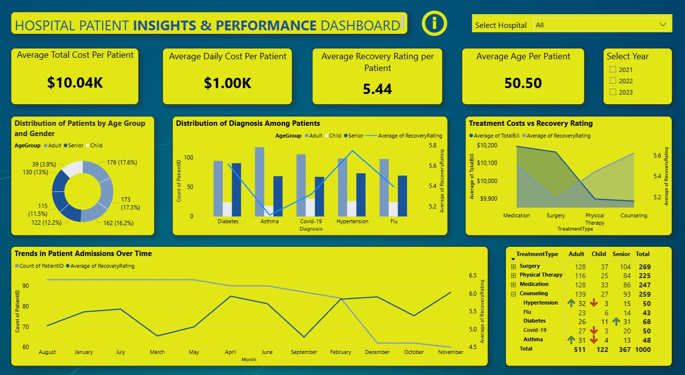

# Hospital Patient Insights & Performance Dashboard

## 📊 Project Overview
This Power BI dashboard provides a comprehensive analysis of hospital performance, focusing on patient costs, recovery rates, and admission trends. It enables healthcare administrators to identify cost drivers and monitor patient recovery metrics across different age groups and treatments.

## 🔍 Key Insights & Metrics
- **Cost Analysis:**
  - **Average Total Cost per Patient:** $10.04K
  - **Average Daily Cost:** $1.00K
  - **Visuals:** Analysis of treatment costs versus recovery ratings reveals high-cost treatments like Surgery ($10k+) vs. lower-cost therapies.
  
- **Patient Demographics:**
  - **Avg Age:** 50.50 Years
  - **Breakdown:** Detailed segmentation by Age Group (Adult, Child, Senior) and Gender using a Donut Chart.

- **Performance Indicators:**
  - **Avg Recovery Rating:** 5.44
  - **Diagnosis Trends:** Combo charts correlating Diagnosis counts (Diabetes, Asthma, Covid-19, etc.) with recovery ratings.
  - **Admission Trends:** Monthly trend line analyzing patient intake volume.

## 🛠️ Tools Used
- **Power BI** (Data Visualization, DAX Measures)
- **Power Query** (ETL & Data Cleaning)
- **Excel/CSV** (Data Source)

## 📂 How to View
1. Download the `.pbix` file from this repository.
2. Open with **Microsoft Power BI Desktop**.
